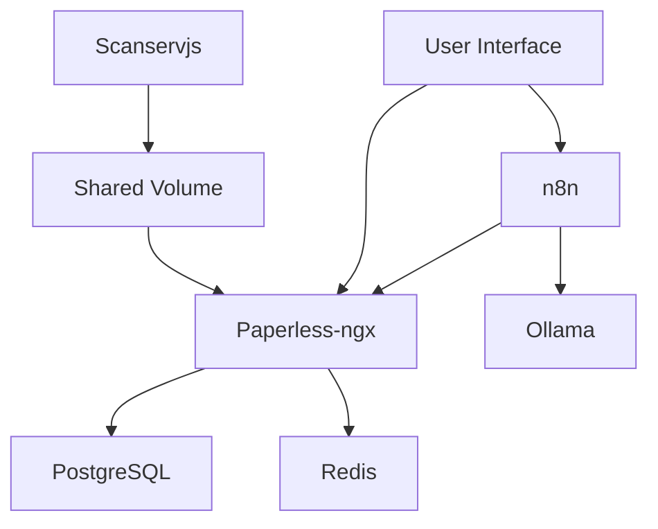

# Architecture Documentation

## System Architecture

Papercuts No More is a comprehensive document digitization and management system that combines six interconnected services running in Docker containers:

### Core Services

#### Webserver (Paperless-ngx)
**Port**: 8010 (external), 8000 (internal)
**Purpose**: Document management API and web interface

**Key Features**:
- Document ingestion, OCR processing, and storage
- REST API with multiple authentication support
- Automatic categorization and tagging
- Web-based document browser and search
- Multiple file format support (PDF, images, office documents)

#### n8n Workflow Automation
**Port**: 5678
**Purpose**: Intelligent workflow automation and AI chat interface

**Key Features**:
- Pre-configured AI-powered chat workflows
- Custom node development for document processing
- REST API integrations
- Scheduled task execution
- Visual workflow editor

#### Ollama Local AI
**Port**: 11434
**Purpose**: Local AI model serving with optional GPU acceleration

**Key Features**:
- Automatic model downloading (qwen3:8b)
- GPU acceleration support (NVIDIA CUDA)
- Persistent model storage at ~/.ollama
- 24-hour model keep-alive
- REST API for AI completions

#### PostgreSQL Database
**Port**: 5432 (debugging only)
**Purpose**: Persistent data storage for all document metadata

**Key Features**:
- Document metadata, OCR results, and relationships
- User permissions and configuration
- Full-text search capabilities
- German localization and collation support

#### Redis Broker
**Purpose**: Caching and message queuing between services

**Key Features**:
- Session management and caching
- Background task queuing
- Inter-service communication
- Performance optimization

#### Scanservjs Scanner Interface
**Port**: 8080
**Purpose**: Web-based document scanning interface

**Key Features**:
- Modern web interface for scanner control
- Multiple scanner hardware support
- Configurable scan settings (DPI, format, etc.)
- Automatic file output to shared volumes

### Data Flow Architecture

```
Scanner Hardware → Scanservjs (port 8080)
                      ↓
              Scans → File System Volume
                      ↓
Paperless-ngx ← OCR/Metadata ← PostgreSQL ← Caching ← Redis
     ↓                     ↑
  REST API ─── n8n Workflows ─── AI Analysis ─── Ollama
     ↓
User Interface (Web)
```

### Service Dependencies



### Network Architecture

#### Internal Docker Network
- Services communicate via Docker networks
- Database connections use service names (e.g., `db`, `redis`)
- n8n connects to Paperless-ngx as `webserver:8000`
- n8n connects to Ollama as `ollama` or `ollama-nvidia`

#### External Access
- Exposed ports for web interfaces: 8010, 5678, 8080, 11434
- PostgreSQL port 5432 exposed for development/debugging
- Secure access through Docker networking

### Storage Architecture

#### Volume Mapping Structure
```
./
├── .docker/
│   ├── postgres/pgdata/_data/      # PostgreSQL data
│   └── webserver/volumes/
│       ├── data/_data/             # Paperless metadata
│       ├── media/                  # Processed documents
│       └── consume/                # Scan input directory
└── ~/.ollama/                      # AI models (host volume)
```

#### Data Persistence Strategy
- Database: PostgreSQL with WAL archiving
- Documents: File system with deduplication
- AI Models: Host-mounted directory for model persistence
- Container logs: Docker volume mounts

### Security Architecture

#### Network Isolation
- Each service runs in separate containers
- Internal communication through secure Docker networks
- No direct external access to databases

#### Authentication Layers
- **Application Level**: Basic Auth (admin/admin123) + Token Auth
- **API Level**: Configurable authentication methods
- **Container Level**: Rootless containers where possible

#### Data Protection
- Encrypted Docker secrets (where applicable)
- Secure volume permissions
- Backup recommendations for critical data

### Performance Architecture

#### GPU Acceleration Path
```
Host GPU → NVIDIA Container Toolkit → Ollama Container → CUDA Runtime → qwen3:8b Model
```

#### CPU Execution Path
```
Host CPU → Ollama Container → C++ Runtime → qwen3:8b Model
```

#### Optimization Strategies
- Model caching and keep-alive (24h)
- Database query optimization
- Redis caching layer
- GPU batch processing

### Deployment Profiles

#### NVIDIA GPU Profile
- Uses `--gpus=all` for GPU passthrough
- Service `ollama-nvidia` with GPU optimizations
- CUDA runtime included
- Accelerated AI processing (up to 500% faster)

#### CPU Profile
- Standard container execution
- Service `ollama` without GPU dependencies
- Broader hardware compatibility
- Suitable for low-power devices

This architecture provides a robust, scalable document digitization pipeline with intelligent AI capabilities while maintaining simplicity in deployment and operations.
